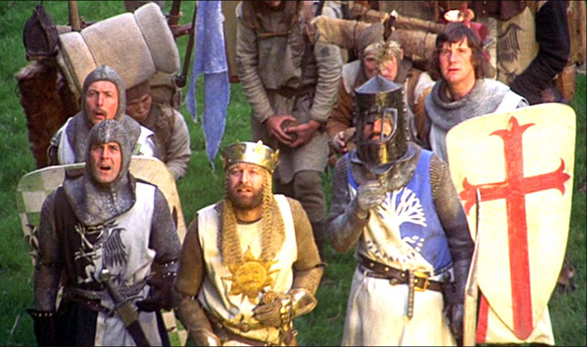

# Welcome to Python Programming 👨🏽‍💻

Python is a popular programming language that was created in the late 1980s by a programmer named Guido van Rossum. 

It's a versatile and easy-to-learn language that is used for a wide variety of tasks in computer programming.

Now, let's talk about the name _"Python."_ Guido, the person who created Python, named it after something he really liked: the British comedy group ``Monty Python``. 

They were famous for their funny and sometimes silly sketches on TV. 

- Guido chose this name because he wanted a fun and unique name for his programming language, and he thought it would be a bit of a joke. 

- So, Python, the programming language, isn't named after the snake, but rather after a group of comedians!

In Python, you can write programs to do all sorts of things:
- Creating websites
- Analyzing data
- Making games, and much more.

It's a great language for beginners because it has a clear and readable ``syntax``, which means the code is easy to understand. 

### That's why Python is often recommended as a great first programming language to learn. 😎