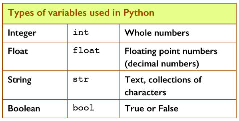

# Introduction to Variables 📚

Variables are containers for storing data values.

- A variable is like a box in memory in which the program will store a value.
- To create a stored memory location you must **_declare_** a variable.
- A variable name is required for every piece of information that your program will store.
- The **_assignment operator_** `=` is used to assign a value to a variable.


Python has no command for declaring a variable.
A variable is created the moment you first assign a value to it.

For example, run the following code in ``main.py``:
````python
x = 5
y = "John"
print(x)
print(y)
````
Variables do not need to be declared with any particular type, and can even change type after they have been set.


## _PREDICT_ 🤔📝
````python
x = 4       # x is of type int
x = "Sally" # x is now of type str
print(x)
````
- What will the program output when the code above is run in ``main.py``?
- Test your prediction.


## Get the Data Type

You can get the data type of a variable with the ``type()`` function.

We can also print out the variable’s type using Python’s ``print(type(variable))``. 

This allows you to find out 
which type Python has chosen for your variable. 

> Try it for yourself in ``main.py``

````python
x = 5           # what type of variable?
y = 6.25        # what type of variable?
z = "John"      # what type of variable?
print(type(x))
print(type(y))
print(type(z))
````


## Variables are Case-Sensitive
Variable names are case-sensitive.
> Try it for yourself in ``main.py``
````python
a = 4
A = "Sally"
# A will not overwrite a. 
# These are two different variables
print(a)
````

## PRIMM Tasks 🤔📝
  1. In your copy, *PREDICT* and write down what the following piece of code will output.

````python
name = "Bilbo Baggins"
age = 111
print("My name is", name, "and I am", age, "years old.")
````


2. In your copy, *PREDICT* and write down what the following piece of code will output.
````python
# Declaring Variables
personName = "Charlie"
favouriteColour = "Green"
print("Hi", personName, "- your favourite colour is", favouriteColour)
print("Goodbye", personName)
````

  

### 💡 Were your predictions correct...Discuss this with your classmates.


