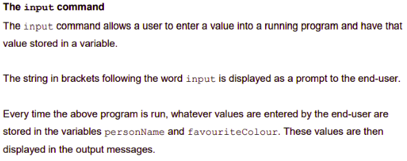

# Input Command 📚
The `input` command allows a user to enter a value into a running program and have that value stored in a variable.

Let's see if we can improve upon the previous program and make it more dynamic.

> Type the following into ``main.py``and run it to see what output you will get.

````python
# Input command
personName = input("Enter your name: ")
favouriteColour = input("Enter your favourite colour: ")
print("Hi", personName, "- your favourite colour is", favouriteColour)
print("Goodbye", personName)
````



## Task 3 👨🏽‍💻
- Write a program that will ask the user to enter their ``name`` and ``address`` and store this in two suitably named variables.
- Output this information on the console.

<details>

<summary> 👀 Hint </summary>

````py 
name = input("")

address = 

print("Your name is ", name, "and you live at ",)
````
</details>

## Task 4 👨🏽‍💻
- Write a program that will ask the user to enter their favourite type of ``music`` and their favourite ``artist`` / `band` and store this in two suitably named variables.
- Output this information on the console.

<details>

<summary> 👀 Hint </summary>

````py 
music = input("")

artist = 

print("My favourite type of music to listen to is: ")
print("My favourite artist / band is: ")
````
</details>


