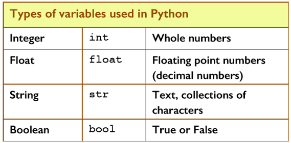
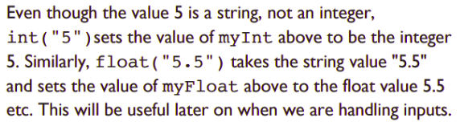

# Variable Types 📚

Python uses 4 main Data Types as shown below:



- `integers` - Examples of integers include: ``2, 606, -3, 0`` etc.
- `floats` - Examples of floats include: ``0.6, -9.55, 35.02`` etc.
- `strings` - Examples of strings include: ``"Hello, World!"``, ``"John"``, etc.
- `Boolean` - can only be `True` or `False`, we will learn more about these later in the year.

## Task 1 👨🏽‍💻
Type up this program and run it in ``main.py``:
````python
x= 5
print(type(x))
x = 5.1
print(type(x))
````

### 💡NOTE: 
We did not have to tell Python that variable `x` (initially a type int) needed to be changed to type ``float``. Python detected this itself and made the change.

### Why?? 🤔

# Casting from one variable type to another.📚

## Converting from type `int` to `float`.

> Type this program into ``main.py`` to convert a variable to a float:
````python
x = 5
print(type(x))    # prediction...

x = float(5)
print(type(x))    # prediction...
print(x)          # prediction...

x = 6.1
print(type(x))    # prediction...
print(x)
````
Add ``# comments`` to each line of code to *PREDICT* what each line will output. Run the code to check your answers.

## Converting from type ``float`` to ``int``.

> Amend the program to read like this:
````python
x = float(8)    # what does this do??
print(type(x))

x = int(7.1)   # what does this do??
print(type(x))
````
Again add ``# comments`` to describe what each line is doing.

- Add another line to the program above to display the value of variable x on the screen using ``print(x)`` as the fifth line of code. What do you think its value will be? Why? 🤔
>

## We can convert any Python variable 📝
````python
# Code Block A
myInt = int("5")
myFloat = float("5.5")
myString = str(5)
myBool = bool("False")
````


## Task 2 👨🏽‍💻
Add the following code to to ``Code Block A`` to display the variable types:
````python
# Code Block B
print(type(myInt))
print(type(myFloat))
print(type(myString))
print(type(myBool))
````

## Task 3 👨🏽‍💻
Finally add some code to display the output of the variables on the console.

````python
# You need to figure this out yourself...
print()
````

## Task 4 👨🏽‍💻
Suppose we want to print 3 variables to the console with some descriptive text. 

````py
hero = "IronMan"
villain = "Thanos"
num = 6
````
Can you figure out how to display the message below, using the 3 variables shown above:

````
IronMan used all 6 Infinity Stones to defeat Thanos.
````

