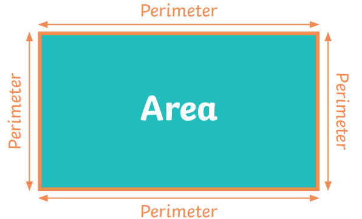

# Area & Perimeter 👨🏽‍💻



Turn to your classmate and have a quick discussion to see if you know the difference between `area` and `perimeter`.

- Using the diagram above, we can see where the equations for `area` and `perimeter` come from.

  - Do you know the formula for `area` of a rectangle?
  - Do you know the formula for `perimeter` of a rectangle?

<details>
<summary> 👀 Hint </summary>

  ````
  Area = L x W

  Perimeter = 2(L + W)
  ````
</details>

## Task 4 👨🏽‍💻
Ask the user for the `length` and `width` of a rectangle.

1. Calculate the `area` of the rectangle and store it in a variable.
   - Print out the calculated area.
2. Calculate the `perimeter` of the rectangle and store it in a variable.
   - Print out the calculated perimeter.

