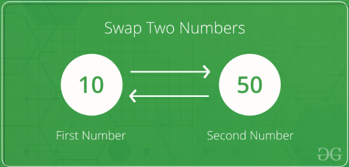

# Number Swapper 👨🏽‍💻🔢



## Task 5 👨🏽‍💻
Create two variables `num1` and `num2` and ask the user to enter two numbers.

- Swap the values of the two variables without using a third temporary variable.
- `print`the values of the variables to show that they have been swapped.


Using this link, [do some research](https://www.programiz.com/python-programming/examples/swap-variables) to help find the solution.

<details>

<summary> 👀 Do you really need another hint??</summary>

   ```python
   num1 = float(input())                  # Prompt user for first number
   num2 = float(input())                  # Prompt user for second number
   
                                          # Swap the values
   
   print("After swapping, num1 =", )  # print swapped num1
   print("After swapping, num2 =", )  # print swapped num2
   ```

  
</details>


