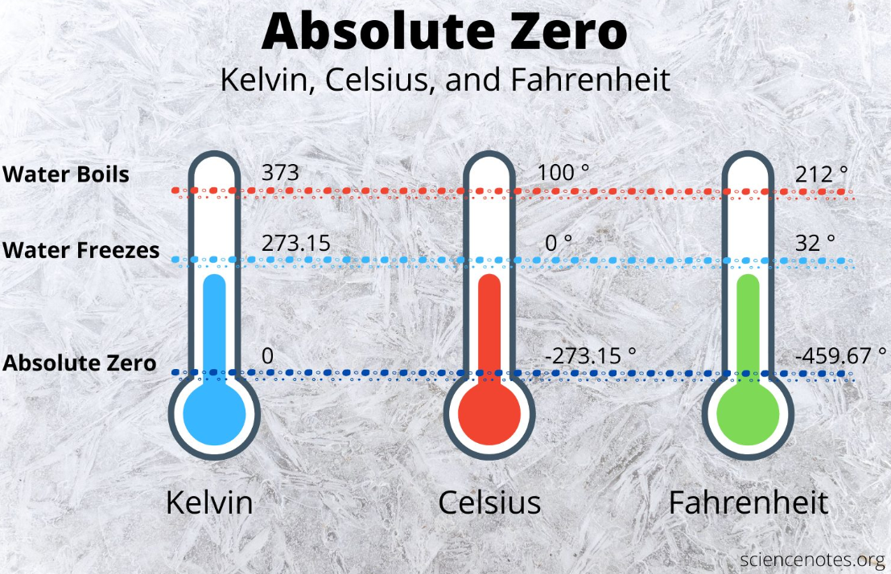

# ✨ Extra Credit - Temperature Converter 



## Task 6 👨🏽‍💻 

- Ask the user to enter a temperature in degrees `celsius` ℃.
- Convert the temperature to Fahrenheit using the formula:

````
     fahrenheit = (celsius * 9/5) + 32
````

- Store the result in a variable `fahrenheit` and print it.

- Remember to use appropriate `# comments` to explain what your code is doing.


>
> 

