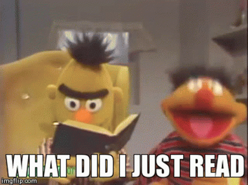

# Mad Libs Game 🎰

## Task 3 👨🏽‍💻


1. Create variables to store the following:
   - a noun
   - a verb
   - an adjective
   - and a place.
2. Ask the user to enter values for each of these variables:

````py
noun = input("Enter a noun: ")
````
   
4. Create a sentence using `fStrings` with these variables to create a _"Mad Libs"_ story.

````py

story = f"Once upon a time there was a {adjective} {noun} who loved..."

````


 