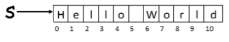
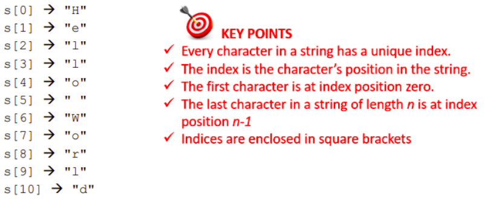
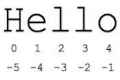

# String Indexing 📚
By far the most important strings operations are *indexing and slicing.*

- _Indexing_ - is a programming technique used to access individual characters of a string.
- _Slicing_  - is a variation on this used to access multiple continuous characters from a string (known as a sub-string or a slice).

Other operations that can be carried out on strings are _addition, multiplication, formatting and comparisons._ 

Strings also support set operations such as `in` and `not in`. These set operations along with comparisons will be discussed in the section on programming logic.

Python also comes with a number of built in commands that can be used on strings as well as a comprehensive set of commands (known as string methods) specifically designed for 
working with strings.

## Indexing
In order to understand string indexing (and slicing) it is first necessary to understand the concept of an index. Consider the string `s` initialised in the line of code shown:

````py
s = "Hello World"
````

Internally, the computer represents the string `s` as a sequence of characters stored at _contiguous_ (next to each other) memory locations. Each individual character is stored in its own separate memory location. 

The individual characters in every Python string have a position. 

This position is relative to the first character in the string and is known as an **_index_**. Because the index is an offset from the first character, the index of the first character itself, in every Python, string is _**zero.**_ 

💡 _Indices are said to be zero-based._


## Index Position ✍
The diagram below depicts the index position of every character in the string `s`.



As can be seen the first character i.e. `H` has an index of `zero`. 

This is important. The first character in a string always occurs at index position zero (this is often called the zeroth 
position), the second character at index position 1, the third character at index position 2 and so on. 

The string `"Hello World"` contains 11 characters and each character has a unique index ranging from `0 to 10`.

In general, when there are `𝑛` characters in a string the last character always occurs at index position `𝑛 − 1`. 

💡 _Therefore, if there are 5 characters in a string the last character occurs at index position 4._

Each individual character of a string can be accessed by enclosing the character’s index inside square brackets `[ ]` as shown below.



## Negative Indices
Python permits the use of negative numbers as indices.

The diagram below depicts the positive and negative indices of the string `"Hello"`. 



As can be seen the last **_(rightmost)_** character of the 
string can be accessed using index `−1`. 

Working from right to left, the index of each character is one less than its predecessor.
