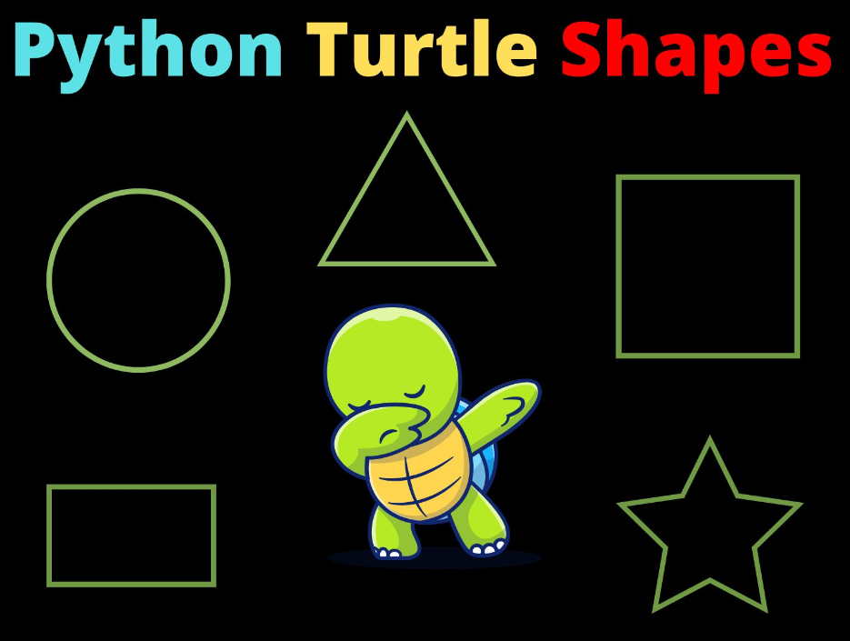

# Drawing Shapes 



## Task 1 - Draw a Square

- Use Turtle graphics to draw a square without loops.
- Manually move the Turtle ``forward`` and turn it ``right`` four times to create each side of the square.

> 👀 Hint: 
````py
turtle.forward(100)  # Side 1
turtle.right(90)

turtle.done()

````

## Task 2 - Draw a Triangle

- Draw an equilateral triangle using Turtle graphics without loops.
 - Manually move the Turtle ``forward`` and turn it ``left`` twice to create each side of the triangle.

> 👀 Hint:
````py
turtle.forward(100)  # Side 1
turtle.left(120)


turtle.done()
````

## Task 3 - Draw a Rectangle

- Draw a rectangle using Turtle graphics without loops.
- Manually move the Turtle forward and turn it ``right`` or ``left`` to create each side of the rectangle.

> 👀 Hint:
````python
turtle.forward(100)  # Side 1
turtle.right(90)


turtle.done()
````

## Task 4 - Draw an "L" shape

 - Use Turtle graphics to draw an "L" shape without loops.
 - Manually move the Turtle forward and turn it ``right`` or ``left`` to create each part of the "L."


## Task 5 - Draw a Circle (Parson's Problem)

 - Use Turtle graphics to draw a circle without loops.
 - Specify the angle and step size to approximate a circle.
 - Arrange the code below in its correct sequence to get your Turtle to draw a circle.

```python
turtle.forward(1)

turtle.done()

# Use a for loop to iterate through steps 
for _ in range(360):
    
turtle.right(1)
 
```

## Task 6 - Draw a Circle with user input

 - Use Turtle graphics to draw a circle.
 - Prompt the user to enter the ``radius`` of the circle.
 - Use the `circle()` method with the specified radius.

```python
# Prompt user to enter a value for radius.  
# Convert (cast) this from a type-string to type-integer.
radius = int(input(""))

turtle.circle(radius)

turtle.done()
```

## Task 7 - Draw a Star

- Draw a star shape using Turtle graphics without loops.
- Manually move the Turtle forward and turn it right to create each part of the star.

> 👀 Hint 
```python
turtle.forward(100)  # First arm
turtle.right(144)    # Why choose this number??


turtle.done()
```

## 🤔 Question to make you think?
#### What is the significance of the number ``144`` inside the turn right code? i.e. `turtle.right(144)`.


## ✨Extra Credit:
Let's say we wanted to draw a square spiral shape. 
We can use a `for loop` to help us with this. 

- While we haven't learned how to use loops yet, we did see one earlier in `Task 5 - Draw a Circle`.

  - Run the code below and edit it to change the spiral shape that gets produced.
  - Examine the code below and add `# comments` to the code to explain what each line is doing.


````py
# Explain the code below: 
num_iterations = int(input("Enter the number of spiral iterations: "))
side_length = 10  # Set initial side length to 10.


# Question: What does the code below do?
# Answer: 

for _ in range(num_iterations):      # Explain:
    turtle.forward(side_length)      # Explain:
    turtle.right(90)                 # Explain:
    side_length += 10  # Increase side length

turtle.done()


````