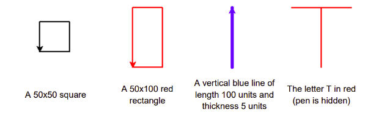
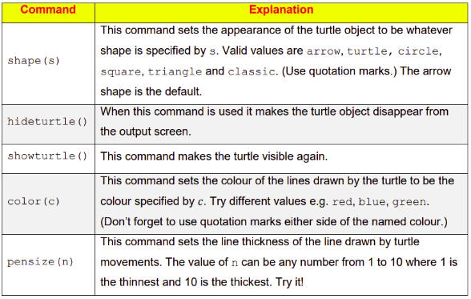

# Challenges ⚔️ 

## Part A
Using what we have learned in the previous 2 pages, write some Python programs to display the shapes shown below.



The table below might help you:



## Part B
Experimenting with the `fill` command, see what changes you can make to your shapes.

> For example:
````py
turtle.fillcolor("red")
turtle.begin_fill()

# Draw a square
for _ in range(4):
  turtle.forward(50)
  turtle.right(90)

turtle.end_fill()
````

### 💡Again, remember to add `# comments` to your code to explain what is happening.
