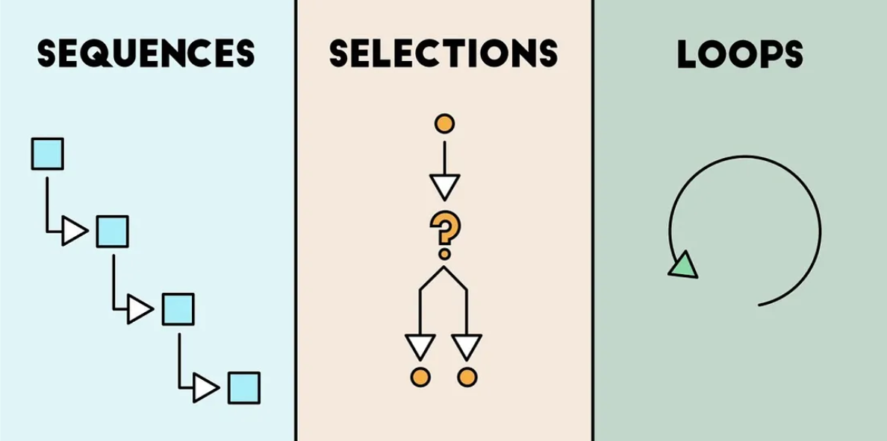

# Introduction to Programming Concepts 📚

Up until now, our journey in programming has revolved around writing programs that follow a straightforward path, starting from the first line and progressing line by line until the end. This type of program is known as a sequential program.

But guess what? Programming offers us more exciting tools beyond just following a sequence! Today, we're diving into two special concepts: **Selection** and **Iteration.**

## Selection (Decision Making 🤔)

Imagine your program being a clever decision-maker! Selection structures, often called decisions, give your program the power to choose between different paths. Depending on certain conditions (expressed as Boolean expressions), specific blocks of code can either be executed or skipped during runtime.

In the world of Python, the key decision-making keywords are ``if``, ``else``, and ``elif``. These little helpers allow your program to make decisions and choose the right path dynamically.

## Iteration (Looping Around 🔄)

Now, let's introduce the concept of loops, the rockstars of repetition! Loops let you run the same block of code multiple times. Picture it like a merry-go-round for your code: as long as a certain condition (a Boolean expression, again!) holds true, the loop keeps spinning, executing the code inside.

In Python, the loop maestros are ``for`` and ``while``. They allow your program to dance through repetitive tasks with ease.

And here's a quick shoutout to three loop-related keywords: ``break``, ``continue``, and ``pass``—they're like special moves your program can perform within a loop.

So, get ready to level up your programming skills as we explore the syntax and magic of selection and iteration. These concepts are like the secret sauce that turns your code into a powerful and dynamic force! 🚀