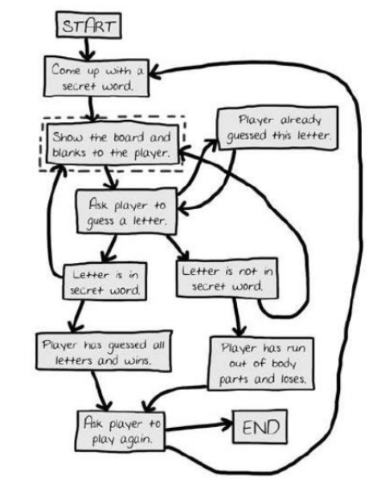
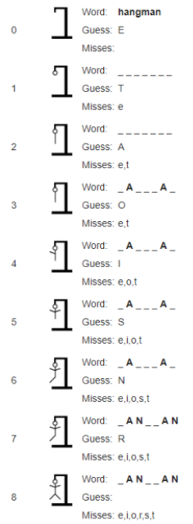

# Unveiling the Power of Boolean Expressions 📚

A Boolean expression is like a coding crystal ball, revealing either a triumphant ``True`` or a defiant ``False`` when evaluated.

🤔 Wondering where this magic comes from? 

Let's take a quick trip back in time to meet George Boole, the math wizard (1815-1864) and the inaugural professor of Mathematics at University College Cork (UCC). He gifted us with Boolean Logic, the brainchild behind these binary wonders. 

Back in the day, people couldn't fathom the use of such math sorcery. But then, as computers entered the scene, something incredible happened. They began to crunch data and make logical decisions, asking questions and tailoring actions based on the answers. 

Enter *Boolean logic*—the superhero that emerged right on cue! 😎

The algebra on which Boolean logic is based is used extensively to build electronic circuits and write computer programs. Boolean logic, therefore, forms the basis of all modern digital devices and software systems. Every digital device and software system owes its existence to the magic of Boolean logic.

Think of Boolean expressions as the superheroes of Boolean algebra, just like algebraic expressions (3x² − 2y + c) are to algebra and arithmetic expressions (4 + 2 = 6) are to arithmetic. 

These expressions, at any given moment, take a stance either ``True`` or ``False``— no middle ground allowed. It's the secret language that powers the heart of modern technology! 🚀

## Hangman ✍
Hangman is a well-known guessing game usually played by two people using pencil and paper. One player thinks of a word and the other tries to guess it by suggesting letters within 
a certain number of guesses.

The illustration below depicts the main steps *(flow chart)* of the game.

The graphic below illustrates a sample run of the game, where the player is trying to guess the word hangman.

## Task 1
👉 Study the illustrations above carefully and identify the areas where _"sequence", "selection"_ and _"iteration"_ could be used in a programming solution for the game.

>
> 
