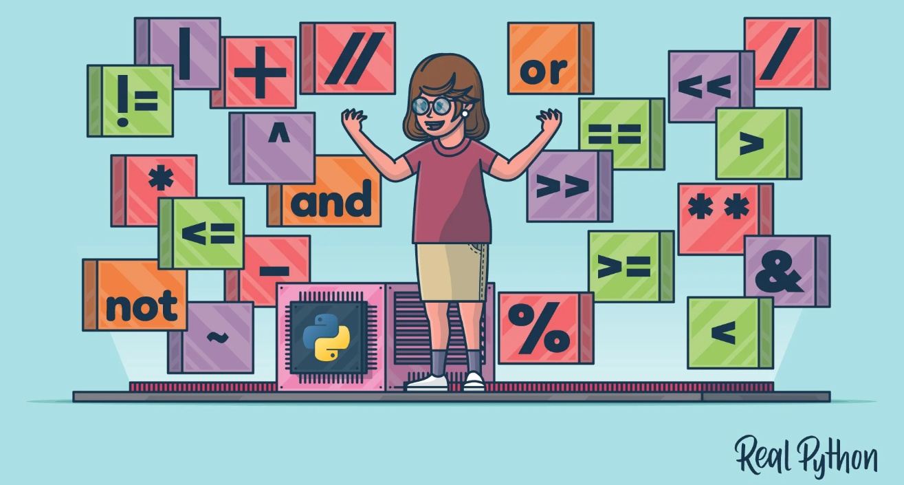
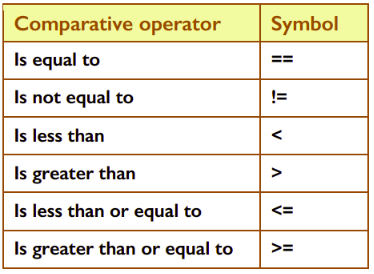
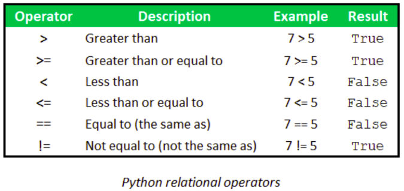
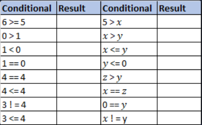
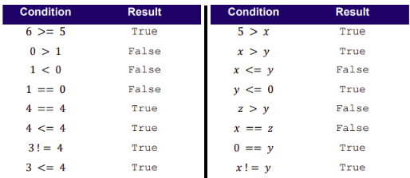

# Unraveling the Art of Making Comparisons 📚



## Comparative Operators
In the grand world of programming, there comes a time when we need the computer to play matchmaker, comparing one item to another and noting the outcome. Enter *Comparative Operators*, the tools for these comparisons. Let's take a peek at their symbols in Python, as illustrated in the table below:



### 🕵🏽‍♂️ Ever noticed the unique symbol for the *“Is equal to”* operator? It's a double equals sign `==`, why the pair and not just one?

## Simple Boolean Expressions

A simple Boolean expression is one that uses a single relational operator _(e.g. greater than, less than or equal to etc.)_ to compare _(i.e. relate)_ two values. 

- For example, ``7 > 3`` (seven greater than three) is a simple Boolean expression that compares the numbers 7 and 3 under the relation of ‘greater than’. It evaluates to ``True`` because 7 is a bigger number than 3. 

- On the other hand, the expression ``7 < 3`` evaluates to ``False``, because 7 is not less than 3.

These simple Boolean expressions, born from the basic relational operators, are the Lego bricks of Python. They're the foundation used to construct decisions and loops, adding that extra dose of logic to your code.

Behold the six relational operators Python has in its arsenal:




## Task 2 - Predict ⚔️
Time to put on your prediction hat! 🎩 Take a look at the conditions below and, using your intuition, label each with either ``True`` or ``False``.



<details>
  <summary> 👀 Solution - Don't click this until you've tried it yourself.</summary>
  Oh no, you peeked!

 

</details>

## Task 3 - Investigate 🕵🏽‍♂️
Ready to put your predictions to the test? Fire up `main.py` and bring the table to life in the console. Here's a little kickstart for you:

```python
# Initialise variables x, y, and z
x = 1
y = 0
z = -1

print(6 >= 5)
```

Let the coding begin! 🚀