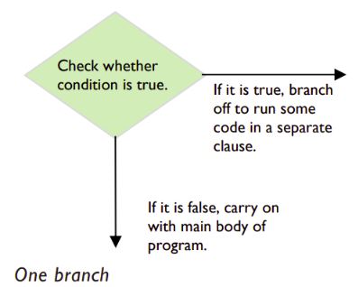

# Navigating through Conditionals 📚

In the world of computer programming, decisions often lead us down different paths, and the tools we use for this are called *conditionals*.

Conditionals rely on Boolean expressions to determine whether something is ``true`` or ``false``. Based on this determination, the program takes a specific route, or branch. Imagine when you're at the self-checkout in a supermarket, choosing between cash or card. The computer reacts differently depending on your payment method selection. In programming, branches are executed only if the overall Boolean expression evaluates to ``True.``

Now, let's delve into the practical side of things with some *"if statements,"* building upon our understanding of Boolean expressions.

## if statements

The most straightforward type of conditional is an ``if`` statement, featuring a single branch, as shown below:



### 💡*Note:* 
If the condition is true, the code within the if statement's branch (also known as a clause) gets executed. However, if the condition is false, the clause is skipped, and the program moves on to the next statement in its main body.

Ready to apply these concepts in your code? Let's dive into the world of conditionals!

## Task 4 - Self Checkout (Parson's Problem)⚔️

You are tasked with creating a simple self-checkout display for a supermarket. The program should ask the user to choose between paying with cash or card. Depending on the user's selection, the program should display different responses. Use basic print statements to display the messages.

Your program should follow these steps:

1. Display a welcome message prompting the user to start the self-checkout.
2. Ask the user to choose a payment method by entering '1' for cash or '2' for card.
3. If the user enters '1' for cash, print a message indicating that cash payment is selected.
4. If the user enters '2' for card, print a message indicating that card payment is selected.
5. If the user enters any other input, print an error message indicating an invalid choice.

### Here is some sample code to help you get started, the code is jumbled up!

```python
# Process user input
if payment_choice == '1':
print("Cash payment selected. Please insert your cash.")

# Welcome message
print("Welcome to Self-Checkout!")

# Ask for payment method
print("Choose a payment method:")
print("")
print("")

elif payment_choice == '2':
    print("")
    
# Get user input
payment_choice = input("")
    
else:
    print("Invalid choice. Please enter '1' for cash or '2' for card.")
```

### 💡 Note:
Run the program and test it by entering different choices for payment methods. Observe how the program responds to your selections.