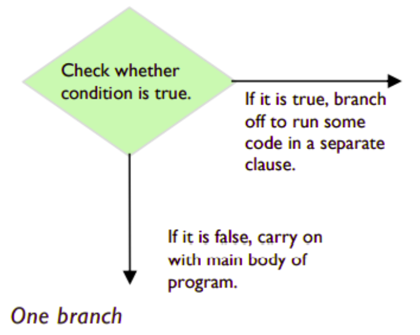

# Conditional statements 📚


## Remember - if 🤔
The simplest type of conditional is an _if statement_. This statement has only a single branch.



If the condition is ``True``, then the computer executes the code in the branch following the ``if`` statement. This piece of code is also known as a clause. If the condition is *not true*, the clause is skipped and the next statement in the main body of the code is executed.

## Task 1 👨‍💻
Let’s go back to the automatic checkout. 

Here the shopper will be asked if they have a loyalty card. If the answer is “Y” the computer will invite the customer to scan their card. If the customer does not answer “Y”, the loyalty card clause is skipped and the main program continues.

👉 Type the following in `main.py`
````py
answer = input("Do you have a loyalty card? (Y/N) ")
````
Now we will use a *Boolean expression* to state the 
condition:

````py
if answer == "Y":
````

💡 Note the colon `:` at the end of the line. 

This is extremely important in Python. Notice that the editor may create an indent on the next line automatically. If it doesn’t, use the tab 
key to indent the code. 

The indented code is the code that is executed if the conditional statement returns the value ``True``.

👉 Indent and type:
````py
   print("Please scan your card.")
````

👉 Assuming the shopper has a card, the output is: 
````
Do you have a loyalty card? (Y/N) Y
Please scan your card.
````
