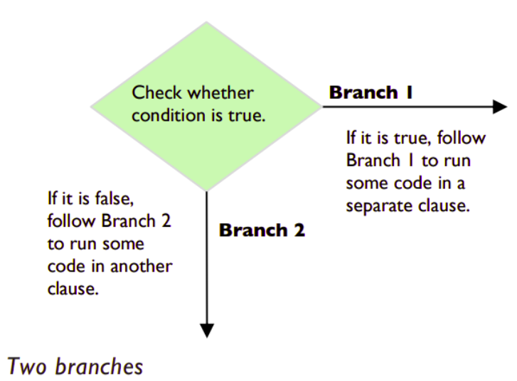

# else 📚

## Two branches – using else

Sometimes the computer needs to execute another clause of code if the condition is not ``True``. 

For example, suppose a customer answered “N” to the loyalty card question, the shop could take the opportunity to remind the person to sign up for a card, before resuming the rest of the program.

In such cases, it is necessary to add another branch of code 
to the program. This branch will be followed if the condition 
in the ``if`` statement is ``False``, as shown in the following 
diagram.



Returning to the checkout example, we will add the code for a second branch, using the conditional called the ``else`` statement.

## Task 2 👨‍💻
Make sure that the cursor is lined underneath the ``if`` in your 
previous program. 

👉 Type the following in `main.py`:
````py
else:
````

💡 Note the colon at the end of the line and the indent on the 
next line. After the indent type:
````py
print("Do you want to sign up for one?")
````
The complete Python script should now look like this:

````py
answer = input("Do you have a loyalty card? (Y/N): ")
if answer == "Y":
  print("Please scan your loyalty card.")
else:
  print("Do you want to sign up for one?")
````

If the user does not have a loyalty card, the output will look something like:
````
Do you have a loyalty card? (Y/N): N
Do you want to sign up for one?
````

💡 Again pay close attention to your indentations!

👉 Experiment with and *Modify* your code to accept different answers and see how they effect your program, e.g. *(Yes, No)*

