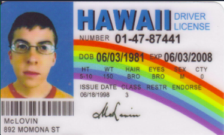

# Driving License Application 

## Task 1 👨🏽‍💻

- Begin by drawing a flow chart to show the branching _(decision making)_ involved in the program.
- This can be done by using or creating a `.draw` file.

[What is a Flow Chart](https://www.tutorialspoint.com/programming_methodologies/programming_methodologies_flowchart_elements.htm)

## Task 2 👨🏽‍💻
👉 Create a program that asks a user for their ``age``.

👉 If they are 18 or older, they can apply for their full license.

👉 If they are between 16 - 18 years old they can apply for their _provisional license._

👉 If they are younger than 16 years old they are _not eligible_ to apply for their license.

### 💡Note:
> You should use `print()` to display suitable responses to the User in the console for each condition.

